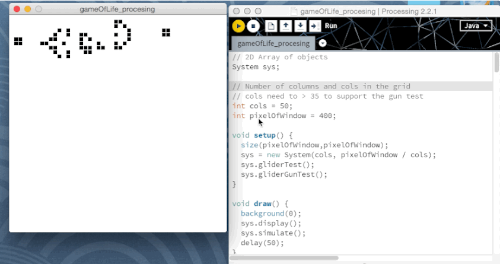

# Game of Life in processing

Just for fun.

## Game of Life

The Game of Life, also known simply as Life, is a cellular automaton devised by the British mathematician John Horton Conway in 1970.

And this is a zero-player game, meaning that its evolution is determined by its initial state, requiring no further input.

So it means if you change the initial state, you will get the different evolution. Random is fun:)

## Processing

>Processing is a programming language, development environment, and online community. Since 2001, Processing has promoted software literacy within the visual arts and visual literacy within technology. Initially created to serve as a software sketchbook and to teach computer programming fundamentals within a visual context, Processing evolved into a development tool for professionals. Today, there are tens of thousands of students, artists, designers, researchers, and hobbyists who use Processing for learning, prototyping, and production.

## Screenshot

<figure>
	
	<figcaption>The GliderGun</figcaption>
</figure>

# Reference

* [Conway's Game of Life - Wiki](http://en.wikipedia.org/wiki/Conway%27s_Game_of_Life)
* [Cellular Automata(Stanford Encyclopedia of Philosophy)](http://plato.stanford.edu/entries/cellular-automata/)
* [processing.org](https://processing.org/)